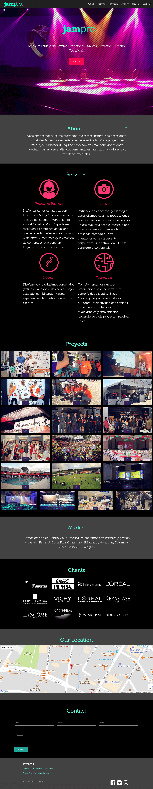

# Jampro Design

This was the first and only website that I created in conjunction with a designer (as of November 16, 2017).
The project used [Materialize CSS](http://materializecss.com/) 


The customer / friend insisted on having a lot of images which increased the page loading time over 10 seconds, despite having optimized the original images. After looking into different techniques, I settled on deffering the images using a technique I found on this website [Varvy](https://varvy.com/pagespeed/defer-images.html) 

```javascript
window.onload = function() {
  loadImages();
}

function loadImages() {
  var imgDefer = document.querySelectorAll('img');

  for (var i=0; i < imgDefer.length; i++) {
    if (imgDefer[i].getAttribute('data-src')) {
      imgDefer[i].setAttribute('src', imgDefer[i].getAttribute('data-src'));
    }
    [].forEach.call(document.querySelectorAll('img[data-src]'), function(img) {
      img.setAttribute('src', img.getAttribute('data-src'));
      img.onload = function() {
        img.removeAttribute('data-src');
      }
    })
  }
}
```

